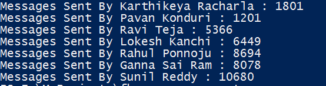

# Facebook-Messages-Counter
Python Script to count the facebook messages

I always had this thought of getting the count of all the messages I sent & received in my group chat with friends and log those messages automatically daily. But never made it into script. As my exams were going on, in no mood for studying I wrote this script.

I used the Graph API v2.2 to get the converstaion details. [This](https://developers.facebook.com/docs/graph-api/reference/v2.2/conversation) is the link for the docs of Graph API. I used [Graph API Explorer](https://developers.facebook.com/tools/explorer/145634995501895/) to check whether I am getting all the required details from the API call. 

The most important thing needed for this script is the initial URL for which request must be send to retrieve the details. That url can be accessed by selecting any of your conversations from [here](https://developers.facebook.com/tools/explorer/145634995501895/?method=GET&path=me%2Finbox&version=v2.2). Please note that Conversation ID is different from Profile/User ID. 

After selecting the conversation ID, a request is called from the explorer and the response is displayed. Copy the url from the `Get Code` button at the bottom right of the explorer. It looks similar to ` https://graph.facebook.com/v2.2/<conversationID>?access_token=###`

For each request I was only getting 25 messages along with url for the next request. So I wrote a while loop which terminates when a boolean `loop` is set to `false`. 

From the initial response, I am saving a lists with Names, Profile Ids, total members in group chat. Once the lists are generated, I am initializing an array with messages count as 0.

I am also updating the variable `url` with the `next` url I get from the response. In each response, after parsing each message, I check the from ID of the message and update the same in messages count list. This process is repeated till all the requests are finished.

Once it is done, I ran a for loop to print the name of the sender and the no. of messages sent by them.

After making the above changes the script looked smething like below.


```
import requests
import json
from time import sleep

## We had proxy enabled in our institute. Comment the below lines if not needed.
http_proxy  = "http://host:port"
https_proxy = "https://host:port"
proxyDict = { 
              "http"  : http_proxy, 
              "https" : https_proxy
    }

## Select any of your conversation ID from here https://developers.facebook.com/tools/explorer/145634995501895/?method=GET&path=me%2Finbox&version=v2.2
## Replace the <conversationID> and access_token from your Graph API explorer
##URL for the converstaion : https://graph.facebook.com/v2.2/<conversationID>?access_token=###
## Please note that Profile ID and Cnversation ID are not same. 
url = '###'

first = True
loop = True
requests_count = 0
peoples = []
ids = []
count = 0

resp = requests.get(url,proxies=proxyDict)
data = resp.json()
mums = data['to']['data']
for mum in mums:
	peoples.append(mum['name'])
	ids.append(mum['id'])
	count += 1
sleep(1)

messages_count = [0]*count

##Used Sleep several times to escape from the API rate limiting. 
##There might be some cases of Access Token Expiration. In that case, decrease the time of sleep.
while loop:
	try:
		print requests_count
		resp = requests.get(url,proxies=proxyDict)
		if first:
			data = resp.json()
				messages = data['comments']['data']
				for message in messages:
					for i in range(0,count):
						if message['from']['id'] == ids[i]:
							messages_count[i] = int(messages_count[i]) + 1
							break
				url = data['comments']['paging']['next']
				first = False
				requests_count += 1
				sleep(0.5)
		else:
			data1 = resp.json()
				if(data1['data']):
					messages = data1['data']
					for message in messages:
						for i in range(0,count):
							if message['from']['id'] == ids[i]:
								messages_count[i] = int(messages_count[i]) + 1
								break
					url = data1['paging']['next']
					requests_count += 1
					sleep(0.5)
				else:
					loop = False
	except IOError as e:
		print "Socket error. Sleeping for 2 seconds"
		sleep(2)
		continue
	except requests.exceptions.ConnectionError as e:
		print "Proxy Error. Sleeping for 2 seconds"
		sleep(2)
		continue


## Printing the Member names and there messages count respectively.
for i in range(0,count):
	print "Messages Sent By " + str(peoples[i]) + " : " + str(messages_count[i])
```

I ran the script. It was going good till so0me time but I was getting various exceptions with which I had to run script again and again.  I changed the script to handle those exceptions also so that the script won't stop till the end.

Some of the exceptions I got are :

-   API call limit exceeded. I handled this exception by making the script to sleep for 20 seconds.
-   Response does not contain 'data'. This exception arises when there is no more messages in the conversation. I made the script to break once this arises.
-   Socket and Proxy Error. As I was behind the proxy I had tohandle these exceptions.


---

Below is the image of the result of my group chat with my friends.



---

This script can be used to both count the messages and also log the messages. Some slight changes should be made to log the messages of the conversation. 

I will update a new script to get the conversation ID from the given Profile ID later.

Fork or Star it if you like it. 

You can mail me at <a href="mailto:sunil@suniltatipelly.in">sunil@suniltatipelly.in</a> for any queries or doubts regarding this.
